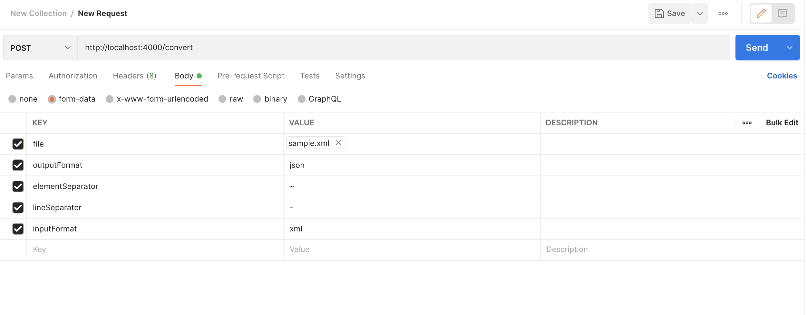

# Orderful Assignment: Document Converter API

## Overview

This project implements an API for converting documents between three formats:

1. **String**: Lines (segments) with elements separated by custom delimiters.
2. **JSON**: Structured hierarchical representation of segments and elements.
3. **XML**: XML representation of the data.

---

## Features

- **String Conversion Logic**: Custom implementation to handle conversion to/from string format.
- **JSON/XML Conversion**: Uses libraries for efficient conversion between JSON and XML.
- **Validation**: Ensures valid input formats, separators, and file uploads.
- **Extensibility**: Designed to accommodate additional formats with minimal changes.
- **Testing**: Comprehensive test suite for all functionalities.

---

## Requirements

- **Node.js**: v18 or later
- **npm**: v8 or later

---

## Installation

1. Clone the repository:

   ```bash
   git clone https://github.com/kdandona/orderful-assignment.git
   cd orderful-assignment
   ```

2. Install dependencies:
   ```bash
   npm install
   ```

---

## Running the Application

### Development

```bash
npm run start:dev
```

### Production

```bash
npm run build
npm run start:prod
```

### Running Tests

```bash
npm test
```

---

## API Usage

### Endpoint: **`POST /convert`**

Converts an uploaded file from one format to another.

#### **Request**

- **Headers**:
  - `Content-Type`: `multipart/form-data`
- **Body (Form-Data)**:
  | Key | Type | Required | Description |
  |-------------------|-----------|----------|---------------------------------------------------------|
  | `file` | `file` | Yes | The document to convert (any of the three formats). |
  | `inputFormat` | `string` | Yes | Input format (`string`, `json`, `xml`). |
  | `outputFormat` | `string` | Yes | Desired output format (`string`, `json`, `xml`). |
  | `elementSeparator` | `string` | No | Element separator (required for `string` format). By default uses `*` |
  | `lineSeparator` | `string` | No | Line separator (required for `string` format). By default uses `~` |

#### **Sample Files**

Files kept in samples folder in root can be used with postman to test the functionality.


#### **Example Request**

```bash
curl -X POST http://localhost:4000/convert \
  -F "file=@path/to/input-file.txt" \
  -F "inputFormat=string" \
  -F "outputFormat=json" \
  -F "elementSeparator=*" \
  -F "lineSeparator=~"
```

#### **Example Response**

```json
{
  "ProductID": [
    {
      "ProductID1": "4",
      "ProductID2": "8",
      "ProductID3": "15",
      "ProductID4": "16",
      "ProductID5": "23"
    }
  ]
}
```

---

## File Structure

```bash
src/
├── app.module.ts               # Main application module
├── main.ts                     # Entry point
├── modules
│   └── converters
│       ├── converters.controller.ts   # API controller
│       ├── converters.service.ts      # Core conversion logic
│       ├── converters.module.ts       # Converters module
│       ├── input                      # String-to-JSON converters
│       ├── output                     # JSON-to-XML converters
│       └── providers                  # Providers for input/output converters
└── shared
    ├── dtos                   # Data Transfer Objects
    ├── enums                  # Enums (e.g., FormatType)
    ├── interfaces             # Interfaces for type definitions
    └── utils                  # Utility functions for conversion
```

---

## Testing

### Test Coverage

- **Unit Tests**:
  - Covers services, utilities, and format-specific converters.

### Running Tests

```bash
npm test
```

---
